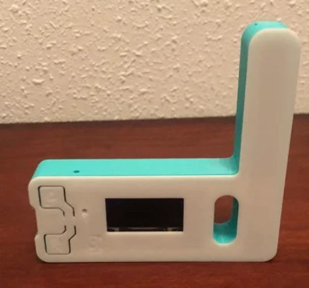

# Table of contents
- [Introduction](#introduction)
- [Requirements](#requirements)
- [Features](#features)
- [Suitable radios and modems](#suitable-radios-and-modems)
- [Related projects](#related-projects)
- [FAQ](#faq)
- [KISS command extensions](#kiss-command-extensions)
- [Planned features](#todo)

# Introduction
**Turn your Android phone into real VHF/UHF Walkie-Talkie (requires additional digital radio modem).**


This minimalistic Android application is a Walkie-Talkie style digital voice frontend for your radio, which uses open source [Codec2](https://github.com/drowe67/codec2) for speech audio frame encoding/decoding. 

It is mainly intended for DV experimentation with ultra low cost 3-8$ radio modems, such as LoRa and 15-25$ esp32 board flavours with built-in LoRa module: T-Beam,
LoPy, TTGO, Heltec and others, but could also be used with custom hardware of software (Direwolf) modems + external transceivers or as a test harness for Codec2 frames generation and their playback.



Application connects to your radio KISS Bluetooth/USB/TCPIP modem, records speech from the phone microphone on transmit, encodes audio into Codec2 format, encapsulates into KISS frames and sends to your modem. 
On receive, modem sends KISS packets to the phone with Codec2 speech, application decodes Codec2 frames and plays them through phone speaker.

It does not deal with radio management, modulation, etc, it is up to your modem and radio, it could be just AFSK1200, GMSK 9600, LoRa, FSK, FreeDV or any other modulation scheme. Radio just needs to expose KISS Bluetooth/USB/TCPIP interface for speech frames.

# Requirements
- Android 7.0 (API 24) or higher
  - Application could also be used with your Android network radio, such as Inrico TM-7, apk just needs to be installed over USB, see [Discussion](https://github.com/sh123/codec2_talkie/issues/4)
- Android 5.0, 5.1, 6.0 (API 21, 22, 23)
  - Separate apk package is released with "legacy" suffix from legacy branch
- Modem, radio module or transceiver which supports [KISS protocol](https://en.wikipedia.org/wiki/KISS_(TNC)) or can process KISS or raw Codec2 audio frames over serial Bluetooth, USB or TCP/IP

# Features
- **PTT UI button**, push and talk, Codec2 speech frames will be transmitted to the modem
- **PTT hardware button**, `KEYCODE_TV_DATA SERVICE` (230 key code) hardware buttons are used for PTT (latter is used on some Android network radios), `KEYCODE_HEADSETHOOK` tx on/off on click, volume up/down buttons could be used for ptt if enabled in Preferences
- **USB serial connectivity** (default 115200 bps, 8 data bits, 1 stop bit, no parity), just select this app after connecting to USB and it will use given connection, baud rate could be changed from Preferences
- **Bluetooth connectivity** on startup, lists paired devices, so you can choose your modem and connect, you need to pair with your Bluetooth device first from Android Bluetooth Settings, default Bluetooth device could be set from Preferences
- **TCP/IP connectivity** on startup, application can connect to TCP/IP based modem and operate through the network, for example, with [Direwolf](https://github.com/wb2osz/direwolf) application and your existing analog transceiver
- **Voice Codec2 mode selection**, which allows you to select various Codec2 modes from 450 up to 3200 bps on the fly, sender and receiver should agree on the codec mode and use the same codec mode on both ends as Codec2 mode negotiation between clients is not implemented at the moment
- **Codec2 loopback mode**, which records and plays your recorded voice back to test and evaluate different Codec2 modes and speech quality, could be enabled or disabled from Preferences, this mode is also activated if no USB/Bluetooth/TCPIP connection was made
- **Voice level VU indicator**, display audio level on transmit or receive
- **S-meter**, displayed only when KISS extensions are enabled and modem is able to send signal level information
- **Parrot mode**, received voice will be digirepated in addition to playback through the speaker
- **KISS buffered mode**, non-real time, playback will start only after all speech is received, use when modem bit rate is lower than Codec2 bit rate to avoid gaps during playback at the cost of longer receiving delay before playback
- **Preferences**, allow to modify default parameters
  - **Application Settings**
    - Enable PTT with volume up/down buttons
    - Keep screen ON
    - Use phone speaker instead of headset
  - **Codec2**
    - Set Codec2 mode/speed from 450 up to 3200 bps
    - Set maximum super frame size in bytes
      - Multiple Codec2 frames are aggregated into one super frame of size not larger than this value
    - Enable/disable echo/loopback test mode
    - Enable/disable RX/TX recorder
  - **TNC parameters**
    - Change default baud rate for USB port
    - Set default Bluetooth device for automatic connectivity on startup
    - Enable KISS over TCP/IP, when enabled USB and Bluetooth connectivity is disabled
      - Set TCP/IP parameters: IP address, port number, number of re-reconnect retries and delay between connect re-tries
  - **KISS**
    - Enable/Disable KISS, when disabled raw Codec2 audio frames will be transmitted
    - Set basic KISS parmaters (P persistence, Slot Time, TX delay, TX tail)
    - Enable/Disable parrot (digirepeater) mode
    - Enable/Disable KISS non-real time buffered playback mode
    - Enable/Disable KISS extensions for radio module control and signal levels (modem must support them to work correctly!)
      - Set radio parameters (frequency, bandwidth, spreading factor, coding rate, power, sync word, crc checksum enable/disable)
      - Send reboot command to the modem
- **Recording player**, simple Voicemail style player, which allows TX/RX recording playback and removal
  - Click on recording starts playback
  - Long click on recording removes it
  - Recording menu allows
    - Remove all items
    - Stop current playback
    - Play all recordings sequentially

# Suitable radios and modems
- Tested, works:
  - (BT) LoRa modem 450/700 bps Codec2 modes tested at 1300 bps and 900 bps LoRa speeds: https://github.com/sh123/esp32_loraprs
  - (BT) custom AFSK1200 LibAPRS based modem with increased TXTail parameter and Baofeng handheld transceiver: 450 works fine, 700 works with small gaps, probably LibAPRS needs some tweaks: https://github.com/markqvist/LibAPRS
  - (USB) HC-12 modules: works, but application needs to use lower USB serial bit rate (change from Preferences), because module RF bit rate is hardwired to its serial bit rate, also module needs to be preconfigured with AT commands first
- Tested, works, but not too stable, probably needs TXTail tuning:
  - (USB) AFSK1200 PicoAPRS: http://www.db1nto.de/index_en.html
  - (BT) AFSK1200/GMSK9600 Kenwood TH-D74A: https://dl1gkk.com/kenwood-th-d74-bluetooth-packet-radio-setup/
- Could work, needs testing:
  - (USB) AFSK1200 MicroModem: https://unsigned.io/micromodem
  - (BT/USB) AFSK1200/GMSK9600 Mobilinkd TNC3: https://store.mobilinkd.com/products/mobilinkd-tnc3
  - (USB) nRF2401L01 2.4 GHz: https://github.com/sh123/nrf24l01_arduino_kiss_modem

# Related Projects
- Source code is integrated into this project for easier building and customization:
  - Codec2 codec: https://github.com/drowe67/codec2
  - Android Codec2 wrapper code: https://github.com/UstadMobile/Codec2-Android
- Fetched with gradle as dependency:
  - Android USB serial: https://github.com/mik3y/usb-serial-for-android
- Other related projects:
  - ESP32 LoRa APRS modem (used with this application for testing): https://github.com/sh123/esp32_loraprs
  - Version adopted for M17 protocol usage: https://github.com/mobilinkd/m17-kiss-ht
  - iOS Codec2 wrapper: https://github.com/Beartooth/codec2-ios
  - Minimal Arduino LoRa KISS modem: https://github.com/sh123/lora_arduino_kiss_modem
  - Minimal Arduino NRF24 KISS modem: https://github.com/sh123/nrf24l01_arduino_kiss_modem
- Other interesting projects:
  - LoRa mesh GPS communicator: https://github.com/meshtastic/Meshtastic-device

# FAQ
- **Gaps in received audio**, indicator often changes between RX/IDLE on the receiver side when sender and recipient are close by then
  - most likely you do not have enough bandwidth, use higher throughput modem mode, for LoRa modems you need approximately 100-150% of data rate for the given codec2 bitrate, AFSK1200 modems should work at 450 bps codec2 mode, 700 bps might work, but not on all modems, higher speed codec2 modes won't work on AFSK1200 for real time, need to enable KISS non-realtime buffering mode
  - modem goes into RX state too fast after sending first packet, increase TxTail parameter for your modem if it does not handle corresponding KISS command, so it will stay longer in TX before switching to RX
  - if you are using LibAPRS based modem, set TxTail and TxPreamble programatically by using `APRS_setPreamble` and `APRS_setTail` methods as it does not seem to set these values from `CMD_TXDELAY` and `CMD_TXTAIL` KISS commands
  - enable KISS buffering mode in Preferences, this will help with gaps at the cost of larger delay on receive before playback
- **Receiving audio on PC/Raspberry**
  - For raw audio frames `sudo cat /dev/ttyUSB0 | c2dec 700 - - | play -t raw -r 8000 -e signed-integer -b 16 -c 1 -`
  - For KISS encapsulated audio frames command above could be used, but instead of `cat` use https://pypi.org/project/kiss/
- **App is not installed** error when installing new application
  - Uninstall previous version and try to install again
- Cannot install application from unknown source
  - You need to allow installation of apps from unknown sources from Android settings, or just install Android Studio and build-install application yourself
  
# KISS command extensions
KISS command extensions are used for radio module control and signal report events on port 0, command for radio control is defined as 6 (KISS SetHardware) and signal report command as 7. Radio modules/modems can implement these commands, so they will be controllable from the application and application will be able to show signal levels on S-meter.

Payloads for commands are sent and expected as big endian and defined as:
```
  // KISS SetHardware 6
  struct SetHardware {
    uint32_t freq;
    uint32_t bw;
    uint16_t sf;
    uint16_t cr;
    uint16_t pwr;
    uint16_t sync;
    uint8_t crc;
  } __attribute__((packed));
  
  // KISS command 7
  struct SignalReport {
    int16_t rssi;
    int16_t snr;  // snr * 100
  } __attribute__((packed));

  // KISS command 8
  struct RebootModem {
  } __attribute__((packed));
`
```

# TODO
- BLE modems support
- Investigate support for other protocols over KISS
  - AX.25 protocol support, voice over AX.25 (VoAX.25)
  - [M17 Project](https://m17project.org) protocol support, including possible gating to [M17 reflectors](https://m17project.org/reflector/) on modem side
- Support for non-KISS modems control if needed
  - HC-12 module control by using AT commands
  - E32-433T30D, should be pre-configured, but can be controlled with AT commands or not?
