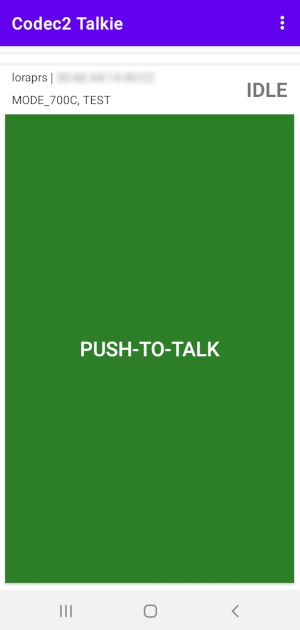

# Android Codec2 Walkie-Talkie
Minimalistic Android KISS Bluetooth/USB modem client for Amateur Radio DV (digital voice) communication by using open source [Codec2](https://github.com/drowe67/codec2).

# Introduction
This minimalistic Android application is a digital voice frontend for your radio. It connects to your radio KISS Bluetooth/USB modem, sends and receives Codec2 audio frames, which are encapsulated inside KISS frames. It does not deal with radio management, modulation, etc, it is up to your modem and radio, it could be just AFSK1200, GMSK 9600, LoRa, FSK, FreeDV or any other modulation scheme. Radio just needs to expose KISS Bluetooth interface for speech frames.

# Requirements
- Android 6.0 (API 23) or higher
- Modem or transceiver which supports [KISS protocol](https://en.wikipedia.org/wiki/KISS_(TNC)) over Bluetooth or USB

# Features
- **PTT button**, push and talk, Codec2 speech frames will be transmitted to the modem
- **USB serial connectivity** (115200 bps, 8 data bits, 1 stop bit, no parity), just select this app after connecting to USB and it will use given connection
- **Bluetooth connectivity** on startup, lists paired devices, so you can choose your modem and connect, you need to pair with your Bluetooth device first from Android Bluetooth Settings
- **Voice codec2 mode selection**, which allows you to select various codec2 modes from 450 up to 3200 bps on the fly, sender and receiver should agree on the codec mode and use the same codec mode on both ends
- **Codec2 loopback mode**, which records and plays your recorded voice back to test and evaluate different Codec2 modes and speech quality

# Suitable radios and modems
- Tested, works:
  - LoRa modem (BT): https://github.com/sh123/esp32_loraprs
- Tested, unstable:
  - AFSK1200 PicoAPRS (USB): http://www.db1nto.de/index_en.html
  - AFSK1200/GMSK9600 Kenwood TH-D74A (BT): https://dl1gkk.com/kenwood-th-d74-bluetooth-packet-radio-setup/
- Could work, needs testing:
  - AFSK1200 MicroModem (USB): https://unsigned.io/micromodem
  - AFSK1200/GMSK9600 Mobilinkd TNC3 (BT/USB): https://store.mobilinkd.com/products/mobilinkd-tnc3

# Related Projects
- Codec2 codec: https://github.com/drowe67/codec2
- Android Codec2 wrapper code: https://github.com/UstadMobile/Codec2-Android
- Android USB serial: https://github.com/mik3y/usb-serial-for-android
- iOS Codec2 wrapper: https://github.com/Beartooth/codec2-ios

# FAQ
- Gaps in received audio
  - If indicator often changes between RX/IDLE on the receiver side when sender and recipient are close by then 
    - most likey you do not have enough bandwidth, use higher throughput modem mode, for LoRa modems you need approximately 170% of data rate for the given codec2 bitrate
    - modem goes into RX state too fast after sending first packet, increase TxTail parameter for your modem, so it will longer TX tail before switching to RX
  
# TODO
- Parrot mode, so speech coming from aether will be transmitted back (testing or digirepeating)
- QSO log, voicemail style recording of incoming speech so that incoming transmissions are not missed
- Separate settings to avoid repeated operations
  - Override default USB serial parameters
  - Default Bluetooth device name to connect upon startup
  - Default codec2 bitrate on startup
  - Settings for parrot mode
  - Settings for QSO log
- Modem profiles, so different modems could be controlled from the UI with KISS command extensions, so that user can change frequency, modulation scheme or other modem parameters on the fly.
